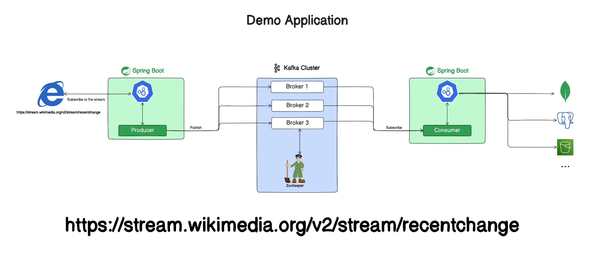

# 🚀 Spring Boot Kafka Reactive Project


A modern Spring Boot implementation demonstrating Kafka integration with Reactive Streams. Features real-time Wikimedia data processing with DynamoDB persistence.

## 📚 Table of Contents
- [✨ Features](#-features)
- [⚙️ Requirements](#️-requirements)
- [🚦 Getting Started](#-getting-started)
- [🧠 Key Concepts](#-key-concepts)
- [🎯 Demo Application](#-demo-application)

## ✨ Features
- Real-time data streaming from Wikimedia
- Reactive Kafka producers/consumers
- DynamoDB integration for data persistence
- Custom serialization/deserialization
- Consumer group management
- Offset tracking implementation

## ⚙️ Requirements
- 
- 
- 

## 🚦 Getting Started

### 🐳 Kafka Setup
<details>
<summary>Start Kafka Services</summary>

```bash
# Start ZooKeeper
$ bin/zookeeper-server-start.sh config/zookeeper.properties

# Start Kafka Broker (in new terminal)
$ bin/kafka-server-start.sh config/server.properties
```
</details>

### 🛠️ Project Setup
<details>
<summary>Clone and Run</summary>

```bash
$ git clone https://github.com/Asirwad/Reactive-RESTAPI-with-Kafka-and-Webflux
$ cd Reactive-RESTAPI-with-Kafka-and-Webflux
$ ./mvnw spring-boot:run
```
</details>

## 🧠 Key Concepts

<details>
<summary>📦 Kafka Architecture Overview</summary>


| Component       | Description                                  |
|-----------------|----------------------------------------------|
| **Producer**    | Publishes messages to topics                |
| **Consumer**    | Subscribes and processes messages          |
| **Broker**      | Manages data storage and distribution      |
| **ZooKeeper**   | Handles cluster coordination               |
</details>

<details>
<summary>🏗️ Kafka Cluster</summary>


- Distributed message broker system
- Horizontal scaling capabilities
- Automatic failover handling
</details>

<details>
<summary>📮 Kafka Producer</summary>


```java
// Example Reactive Producer
public Mono<SenderResult<Void>> sendMessage(String topic, String message) {
    return kafkaSender.send(
        Mono.just(SenderRecord.create(topic, null, null, null, message, null))
    );
}
```
</details>

<details>
<summary>📥 Kafka Consumer</summary>


```java
// Example Reactive Consumer
@Bean
public ReceiverOptions<String, String> receiverOptions() {
    return ReceiverOptions.<String, String>create(consumerProps())
        .subscription(Collections.singleton("wikimedia.recentchange"));
}
```
</details>

<details>
<summary>📂 Topics & Partitions</summary>


| Feature         | Benefit                                      |
|-----------------|----------------------------------------------|
| Partitions      | Enable parallel processing                  |
| Replication    | Ensure data redundancy                     |
| Retention      | Configurable message persistence           |
</details>

<details>
<summary>🔢 Offsets & Consumer Groups</summary>


- **Offset Tracking**: Consumer position management
- **Group Coordination**: Parallel message processing
- **Rebalancing**: Automatic partition redistribution


</details>

## 🎯 Demo Application

### 🔥 Real-time Pipeline


<details>
<summary>📡 Producer Implementation</summary>

**Wikimedia Stream Processor**
- Reactive HTTP client for stream consumption
- Kafka Template for message publishing
- Backpressure management
- Error handling with retries

```java
webClient.get()
    .uri("/v2/stream/recentchange")
    .retrieve()
    .bodyToFlux(String.class)
    .doOnNext(event -> kafkaTemplate.send("wikimedia.recentchange", event))
    .subscribe();
```
</details>

<details>
<summary>💾 Consumer Implementation</summary>

**DynamoDB Persistence**
- Batch record processing
- Exponential backoff strategy
- Consumer group management
- Offset commit strategies

```java
@Bean
public Consumer<Flux<ConsumerRecord<String, String>>> dynamoDbSaver() {
    return flux -> flux
        .bufferTimeout(100, Duration.ofMillis(500))
        .flatMap(batch -> dynamoService.saveBatch(batch))
        .subscribe();
}
```
</details>

## 🛠️ Troubleshooting
<details>
<summary>Common Issues</summary>

**⚠️ ZooKeeper Connection Problems**
- Verify zookeeper.properties configuration
- Check for port conflicts (default 2181)

**⚠️ Consumer Lag**
- Monitor with `kafka-consumer-groups.sh`
- Adjust `max.poll.records` if needed

**⚠️ Serialization Errors**
- Validate message formats
- Check key/value serializer configurations
</details>